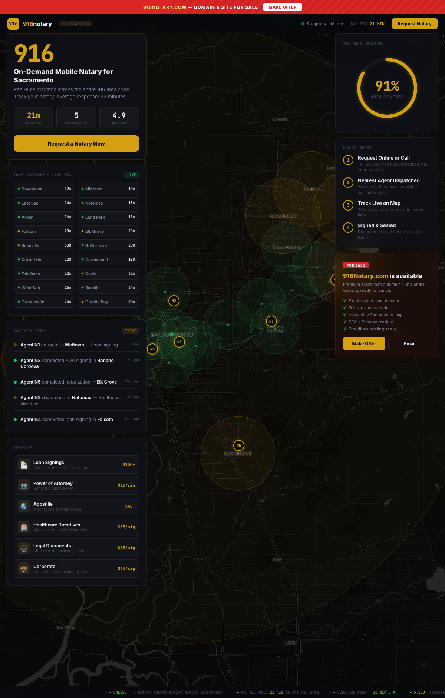

<p align="center">
  
  
  
  
</p>

<h1 align="center">916 Notary</h1>
<p align="center"><strong>Sacramento's On-Demand Mobile Notary Network</strong></p>
<p align="center">
  <a href="https://916notary.com">916notary.com</a>
</p>

<p align="center">
  
</p>

---

## About

Single-page marketing site for a mobile notary service covering the Sacramento 916 area code. Designed to look like a live dispatch operations dashboard with an interactive map, simulated agent tracking, zone ETAs, and an activity feed. Everything runs client-side with no backend.

The domain and site are currently listed **for sale** as a turnkey package.

## Features

- **Interactive Leaflet Map**: Full-screen dark map of Sacramento County with animated agent markers, coverage radius circles, and zone boundaries. CartoDB dark basemap.
- **Simulated Dispatch**: Client-side "live" agent dots that pulse and move across the map. Activity feed cycles through agents completing signings in different neighborhoods.
- **Zone Coverage Grid**: 16-zone ETA display (12m-34m) across Sacramento neighborhoods.
- **Service Catalog**: Pricing for loan signings, POA, apostille, healthcare directives, legal documents, and corporate services.
- **"How It Works" Flow**: 4-step visual guide from request to signed document.
- **SEO + Schema**: `ProfessionalService` JSON-LD, meta tags, canonical URL, area-served structured data.
- **Responsive**: Sidebar collapses below map on mobile. Status ticker at the bottom.
- **For Sale Banner**: Red strip at top with "Make Offer" CTA.

## Tech Stack

| Layer | Technology |
|-------|-----------|
| Frontend | Vanilla HTML/CSS/JS, single file, no build step |
| Map | [Leaflet.js](https://leafletjs.com) 1.9.4, CartoDB dark tiles |
| Fonts | JetBrains Mono (data/UI), Inter (body) via Google Fonts |
| Favicon | Inline SVG data URI |
| Hosting | Cloudflare Pages |

## Project Structure

```
916notary.com/
  index.html      # Entire site (HTML + CSS + JS inline)
  preview.png
  CLAUDE.md
  README.md
```

## Deploy

```bash
wrangler pages deploy . --project-name=916notary-com
```
